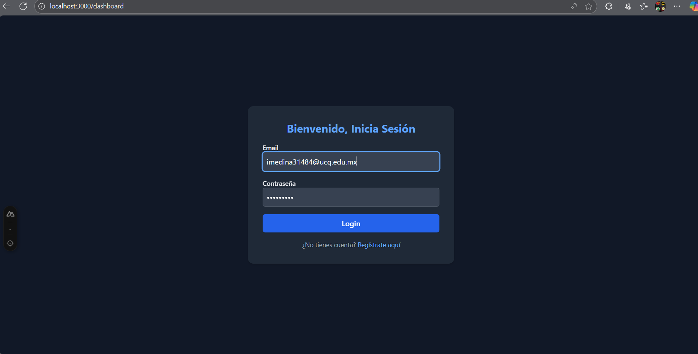
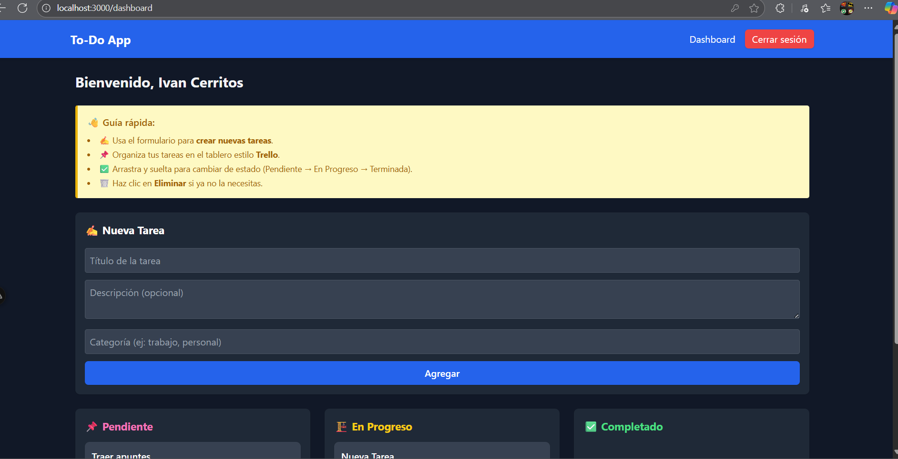

# 📝 Prueba Técnica – To-Do App (Full Stack)

# 📌 Información General
- **Autor:** Iván Medina  
- **Tecnologías utilizadas:**  
  - Frontend: Nuxt 3, Tailwind CSS, Axios, Pinia  
  - Backend: NestJS, Prisma ORM, SQLite  
  - Autenticación: JWT  
  - Arquitectura: Monorepo (frontend + backend en un solo repositorio)

# 🚀 Objetivo del Proyecto
La aplicación permite:  
- Registro e inicio de sesión con protección JWT.  
- CRUD completo de tareas.  
- Organización de tareas en un tablero (drag & drop).  
- Diseño responsivo e intuitivo con Tailwind CSS.  
- Manejo centralizado de estado con Pinia.  

# ⚙️ Instalación y Ejecución

## 1. Clonar repositorio
git clone https://github.com/tu-repo/PruebaTecnica_IM.git  
cd PruebaTecnica_IM  

## 2. Backend (NestJS + Prisma + SQLite)
cd backend  
npm install  
npx prisma migrate dev --name init  
npm run start:dev  

El backend corre en: **http://localhost:3001**

## 3. Frontend (Nuxt 3)
cd ../frontend  
npm install  
npm run dev  

El frontend corre en: **http://localhost:3000**

# 🗄️ Configuración de Entorno

## Backend .env
DATABASE_URL="file:./dev.db"  
JWT_SECRET="your-jwt-secret-key-here"  
PORT=3001  

## Frontend .env
API_BASE_URL="http://localhost:3001"  

# 📋 Funcionalidades Implementadas

## 🔐 Autenticación
- Registro de usuario nuevo.  
- Inicio de sesión con validación de credenciales.  
- Generación y validación de token JWT.  
- Middleware de Nuxt para proteger rutas privadas.  

## ✅ Gestión de Tareas
- Crear nuevas tareas.  
- Editar tareas existentes.  
- Eliminar tareas.  
- Marcar como completadas / pendientes.  
- Tablero estilo Trello con columnas:  
  - Pendiente  
  - En progreso  
  - Completado  
- Drag & Drop para mover tareas entre columnas (actualización en BD en tiempo real).  

## 🎨 UI/UX
- Diseño con Tailwind CSS.  
- Dashboard intuitivo.  
- Formularios limpios y responsivos.  
- Guía visual de bienvenida en el Dashboard.  

# 📂 Estructura del Proyecto
PruebaTecnica_IM/  
├── backend/         # NestJS + Prisma  
├── frontend/        # Nuxt 3 + Tailwind + Pinia   
├── .gitignore  
└── README.md  

# 📊 Decisiones Técnicas
- Monorepo: facilita entregar backend y frontend juntos en un solo repositorio.    
- Prisma ORM: para mantener el modelo de datos claro y con migraciones.  
- Pinia: usado para manejar autenticación y tareas de manera global en frontend.  
 

# 🕒 Limitaciones y Pendientes
Por cuestiones de tiempo (plazo de 2 días):  
- No se implementó modo oscuro/claro (el sistema quedó solo en modo oscuro).  
- No se implementaron notificaciones push ni exportación de tareas.  
- No se incluyó compartir tareas entre usuarios.  

➡️ Se priorizó cumplir con autenticación, CRUD y usabilidad principal. 

# 📸 Capturas de Pantalla

## Pantalla de Login

## Dashboard con tareas

